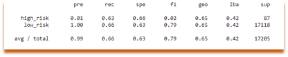
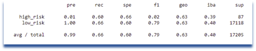
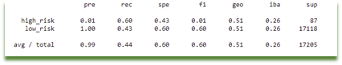
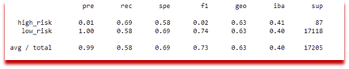
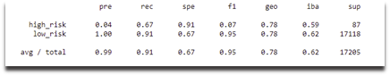
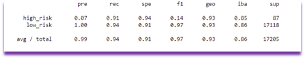

# Module_17_Credit_Risk_Analysis
UNC Bootcamp - Module 17 Challenge

## <i><b>Naive Random Oversampling </i></b>

&nbsp;&nbsp;&nbsp;&nbsp;&nbsp;    
  

## <i><b>SMOTE Oversampling </i></b>

&nbsp;&nbsp;&nbsp;&nbsp;&nbsp;    
  

## <i><b>Undersampling </i></b>

&nbsp;&nbsp;&nbsp;&nbsp;&nbsp;    
  

## <i><b>Combination (Over and Under) Sampling   </i></b>

&nbsp;&nbsp;&nbsp;&nbsp;&nbsp;    
  

## <i><b>Balanced Random Forest Classifier </i></b>

&nbsp;&nbsp;&nbsp;&nbsp;&nbsp;    
  

## <i><b>Easy Ensemble AdaBoost Classifier   </i></b>

&nbsp;&nbsp;&nbsp;&nbsp;&nbsp;    
  
