# Module_17_Credit_Risk_Analysis
UNC Bootcamp - Module 17 Challenge

## OVERVIEW
The goal of this project was to determine which, if any, of six modeling processes for machine learning would provide a better prediction of high-risk credit card consumers.  The data was supplied from LendingClub in a csv format.  The data was oversampled with RandomOverSampler and SMOTE algorithms, undersampled with the ClusterCentroids algorithm, and a combination of the two with the SMOTEENN algorithm.  Two machine learning models, BalanceRandomForestClassifier and EasyEmsembleClassifer, were also applied to the data.

## RESULTS
The following results were derived from the testing.  Below are images of the sampling results for all six models.    
•	The Balanced Accuracy Scores for each model were:  
  &nbsp;&nbsp;&nbsp;&nbsp;&nbsp;	Naive Random Oversampling:  65%  
  &nbsp;&nbsp;&nbsp;&nbsp;&nbsp;	SMOTE Oversampling:  63%  
  &nbsp;&nbsp;&nbsp;&nbsp;&nbsp;	Undersampling: 52%  
  &nbsp;&nbsp;&nbsp;&nbsp;&nbsp;	Combination (Over and Under) Sampling:  64%  
  &nbsp;&nbsp;&nbsp;&nbsp;&nbsp;	Balanced Random Forest Classifier :  79%  
  &nbsp;&nbsp;&nbsp;&nbsp;&nbsp;	Easy Ensemble AdaBoost Classifier: 93%   

•	The Precision Scores for high-risk for each model were: 
 &nbsp;&nbsp;&nbsp;&nbsp;&nbsp;	Naive Random Oversampling:  1% 
 &nbsp;&nbsp;&nbsp;&nbsp;&nbsp;	SMOTE Oversampling:  1% 
 &nbsp;&nbsp;&nbsp;&nbsp;&nbsp;	Undersampling: 1% 
 &nbsp;&nbsp;&nbsp;&nbsp;&nbsp;	Combination (Over and Under) Sampling:  1% 
 &nbsp;&nbsp;&nbsp;&nbsp;&nbsp;	Balanced Random Forest Classifier :  4% 
 &nbsp;&nbsp;&nbsp;&nbsp;&nbsp;	Easy Ensemble AdaBoost Classifier: 7%  

•	The Recall Scores for high-risk for each model were: 
 &nbsp;&nbsp;&nbsp;&nbsp;&nbsp;	Naive Random Oversampling:  63% 
 &nbsp;&nbsp;&nbsp;&nbsp;&nbsp;	SMOTE Oversampling:  60% 
 &nbsp;&nbsp;&nbsp;&nbsp;&nbsp;	Undersampling: 60% 
 &nbsp;&nbsp;&nbsp;&nbsp;&nbsp;	Combination (Over and Under) Sampling:  69% 
 &nbsp;&nbsp;&nbsp;&nbsp;&nbsp;	Balanced Random Forest Classifier :  67% 
 &nbsp;&nbsp;&nbsp;&nbsp;&nbsp;	Easy Ensemble AdaBoost Classifier: 91%  

## Summary

## <i><b>Naive Random Oversampling </i></b>
&nbsp;&nbsp;&nbsp;&nbsp;&nbsp;   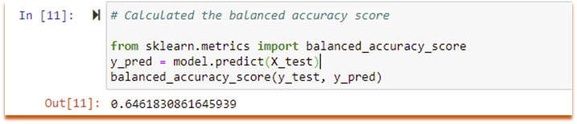 
  
&nbsp;&nbsp;&nbsp;&nbsp;&nbsp;   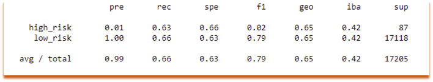 
  

## <i><b>SMOTE Oversampling </i></b>
&nbsp;&nbsp;&nbsp;&nbsp;&nbsp;   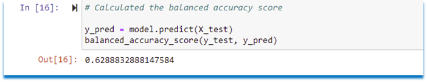 
  
&nbsp;&nbsp;&nbsp;&nbsp;&nbsp;   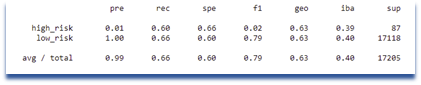 
  

## <i><b>Undersampling </i></b>

&nbsp;&nbsp;&nbsp;&nbsp;&nbsp;   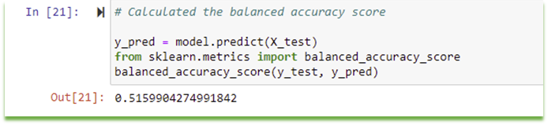 
  
&nbsp;&nbsp;&nbsp;&nbsp;&nbsp;   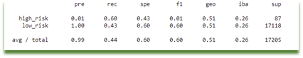 
  

## <i><b>Combination (Over and Under) Sampling   </i></b>
&nbsp;&nbsp;&nbsp;&nbsp;&nbsp;   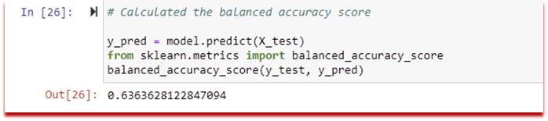 
  
&nbsp;&nbsp;&nbsp;&nbsp;&nbsp;   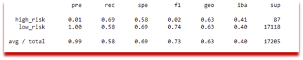 
  

## <i><b>Balanced Random Forest Classifier </i></b>
&nbsp;&nbsp;&nbsp;&nbsp;&nbsp;   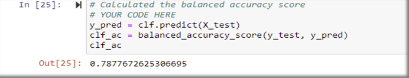 
  
&nbsp;&nbsp;&nbsp;&nbsp;&nbsp;   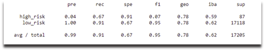 
  

## <i><b>Easy Ensemble AdaBoost Classifier   </i></b>
&nbsp;&nbsp;&nbsp;&nbsp;&nbsp;   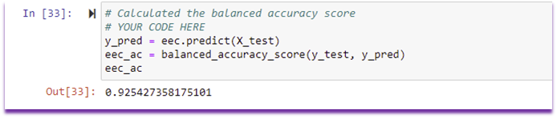 
  
&nbsp;&nbsp;&nbsp;&nbsp;&nbsp;   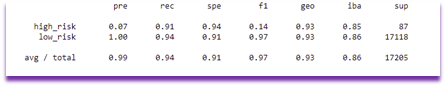 
  
